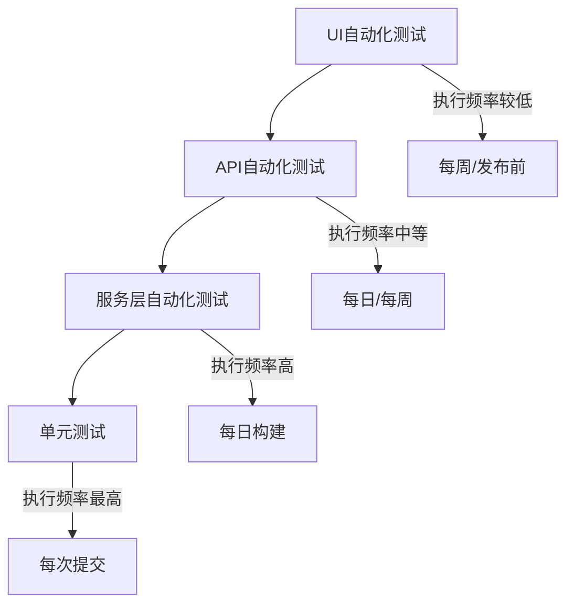

# 测试自动化指南

## 1. 概述

本文档定义了eSIM管理系统测试自动化的策略、工具和最佳实践，旨在提高测试效率、确保测试质量和加速开发流程。

## 2. 测试自动化目标

- 减少手动测试工作量，提高测试效率
- 确保每次代码变更后关键功能的稳定性
- 提供快速反馈机制，缩短开发周期
- 增加测试覆盖率，提高软件质量
- 降低人为测试错误的风险

## 3. 测试自动化范围

- **单元测试自动化**: 开发人员编写的自动化单元测试
- **API测试自动化**: RESTful API接口的自动化测试
- **UI测试自动化**: 用户界面的自动化测试
- **性能测试自动化**: 负载和性能测试的自动化
- **安全测试自动化**: 基本安全漏洞的自动扫描

## 4. 测试自动化工具链

### 4.1 前端测试工具

- **Vitest**: Vue组件单元测试
- **Cypress**: 端到端UI测试
- **Playwright**: 跨浏览器自动化测试
- **Jest**: 通用JavaScript测试框架

### 4.2 后端测试工具

- **pytest**: Python服务测试
- **Go testing**: Go服务测试
- **Postman/Newman**: API测试和自动化
- **Mockoon**: API模拟服务

### 4.3 持续集成工具

- **GitHub Actions**: 自动化测试和CI/CD
- **Jenkins**: 自动化构建和测试流程
- **Docker**: 测试环境容器化

### 4.4 测试报告工具

- **Allure**: 测试报告生成
- **JUnit**: 测试结果格式化
- **Grafana**: 测试结果可视化

## 5. 测试自动化实施策略

### 5.1 分层自动化策略



### 5.2 测试金字塔

- **底层(单元测试)**: 最多数量，覆盖所有核心功能，执行速度快
- **中层(API/集成测试)**: 中等数量，验证模块间集成
- **顶层(UI/端到端测试)**: 最少数量，验证关键用户流程

## 6. 自动化测试示例

### 6.1 单元测试自动化示例 (Python)

```python
# test_user_service.py
import pytest
from app.services.user_service import UserService

@pytest.fixture
def user_service():
    return UserService()

def test_create_user(user_service, monkeypatch):
    # 模拟数据库操作
    def mock_save(user_data):
        return {"id": "123", **user_data}
    
    monkeypatch.setattr(user_service.repository, "save", mock_save)
    
    # 执行测试
    user = user_service.create_user({
        "username": "testuser",
        "email": "test@example.com"
    })
    
    # 验证结果
    assert user["id"] == "123"
    assert user["username"] == "testuser"
    assert user["email"] == "test@example.com"
```

### 6.2 API测试自动化示例 (Postman/Newman)

```javascript
// Postman测试脚本示例
pm.test("验证用户API响应", function() {
    pm.response.to.have.status(200);
    pm.response.to.be.json;
    
    const responseData = pm.response.json();
    pm.expect(responseData).to.be.an("array");
    
    if (responseData.length > 0) {
        pm.expect(responseData[0]).to.have.property("id");
        pm.expect(responseData[0]).to.have.property("username");
        pm.expect(responseData[0]).to.have.property("email");
    }
});
```

### 6.3 UI测试自动化示例 (Playwright)

```typescript
// user-management.spec.ts
import { test, expect } from '@playwright/test';

test.describe('用户管理功能', () => {
  test.beforeEach(async ({ page }) => {
    // 登录
    await page.goto('/login');
    await page.fill('#username', 'admin');
    await page.fill('#password', 'admin123');
    await page.click('button[type="submit"]');
    
    // 导航到用户管理页面
    await page.goto('/admin/users');
  });
  
  test('创建新用户', async ({ page }) => {
    // 点击创建用户按钮
    await page.click('button:has-text("创建用户")');
    
    // 填写表单
    await page.fill('#username', 'newuser');
    await page.fill('#email', 'newuser@example.com');
    await page.fill('#password', 'password123');
    await page.selectOption('#role', 'user');
    
    // 提交表单
    await page.click('button:has-text("保存")');
    
    // 验证成功消息
    await expect(page.locator('.success-message')).toBeVisible();
    
    // 验证用户出现在列表中
    await expect(page.locator('.user-list')).toContainText('newuser');
  });
  
  test('搜索用户', async ({ page }) => {
    // 输入搜索关键词
    await page.fill('#search-input', 'test');
    await page.press('#search-input', 'Enter');
    
    // 验证搜索结果
    const results = page.locator('.user-list-item');
    await expect(results.count()).toBeGreaterThan(0);
    
    // 验证每个结果都包含搜索关键词
    for (let i = 0; i < await results.count(); i++) {
      await expect(results.nth(i)).toContainText('test');
    }
  });
});
```

## 7. CI/CD集成

### 7.1 GitHub Actions工作流示例

```yaml
# .github/workflows/automated-tests.yml
name: Automated Tests

on:
  push:
    branches: [ main, develop ]
  pull_request:
    branches: [ main, develop ]
  schedule:
    # 每天晚上运行一次完整测试
    - cron: '0 2 * * *'

jobs:
  unit-tests:
    name: Unit Tests
    runs-on: ubuntu-latest
    steps:
      - uses: actions/checkout@v3
      
      # 前端单元测试
      - name: Frontend Unit Tests
        working-directory: ./vue-pure-admin-max-main/vue-pure-admin-max-main
        run: |
          npm ci
          npm run test:unit
      
      # Python单元测试
      - name: Python Unit Tests
        working-directory: ./backend/python
        run: |
          python -m pip install --upgrade pip
          pip install -r requirements.txt
          pytest tests/unit
      
      # Go单元测试
      - name: Go Unit Tests
        working-directory: ./backend/go
        run: go test ./...
  
  api-tests:
    name: API Tests
    needs: unit-tests
    runs-on: ubuntu-latest
    steps:
      - uses: actions/checkout@v3
      
      - name: Set up test environment
        run: docker-compose -f docker-compose.test.yml up -d
      
      - name: Wait for services to start
        run: sleep 30
      
      - name: Run API tests
        working-directory: ./backend/python
        run: pytest tests/api
      
      - name: Tear down environment
        if: always()
        run: docker-compose -f docker-compose.test.yml down -v
  
  ui-tests:
    name: UI Tests
    needs: api-tests
    runs-on: ubuntu-latest
    steps:
      - uses: actions/checkout@v3
      
      - name: Install dependencies
        working-directory: ./vue-pure-admin-max-main/vue-pure-admin-max-main
        run: npm ci
      
      - name: Install Playwright
        run: npx playwright install --with-deps
      
      - name: Set up test environment
        run: docker-compose -f docker-compose.test.yml up -d
      
      - name: Wait for services to start
        run: sleep 30
      
      - name: Run UI tests
        working-directory: ./vue-pure-admin-max-main/vue-pure-admin-max-main
        run: npx playwright test
      
      - name: Upload test report
        if: always()
        uses: actions/upload-artifact@v3
        with:
          name: playwright-report
          path: ./vue-pure-admin-max-main/vue-pure-admin-max-main/playwright-report/
      
      - name: Tear down environment
        if: always()
        run: docker-compose -f docker-compose.test.yml down -v
```

## 8. 测试自动化最佳实践

### 8.1 测试设计原则

- **独立性**: 每个测试应独立运行，不依赖其他测试的结果
- **可重复性**: 相同的测试应产生相同的结果
- **清晰性**: 测试代码应易于理解和维护
- **快速执行**: 测试应尽可能快速执行，特别是单元测试
- **全面覆盖**: 测试应覆盖关键功能和边界情况

### 8.2 测试数据管理

- 使用专用的测试数据生成器
- 测试开始前设置测试数据，测试结束后清理
- 避免硬编码测试数据
- 使用环境变量配置测试参数

### 8.3 测试维护策略

- 定期审查和更新测试用例
- 移除过时或不再需要的测试
- 优化测试执行速度
- 建立测试失败响应流程
- 保持测试代码与生产代码同步更新

## 9. 测试自动化成熟度模型

### 9.1 成熟度级别

1. **初始级**: 手动测试为主，少量自动化测试
2. **可重复级**: 关键功能有自动化测试，在CI中运行
3. **已定义级**: 完整的自动化测试策略，覆盖各层级
4. **可管理级**: 测试自动化指标监控，持续优化
5. **优化级**: 自动化测试智能分析，自适应测试策略

### 9.2 成熟度评估标准

- 测试自动化覆盖率
- 测试执行效率
- 自动化测试维护成本
- 测试失败分析和修复时间
- 团队自动化测试技能水平

## 10. 测试自动化报告与分析

### 10.1 自动化测试仪表盘

- 测试通过率趋势图
- 测试执行时间分析
- 测试覆盖率统计
- 失败测试分布
- 自动化测试投资回报率

### 10.2 持续改进流程

- 定期回顾测试结果
- 识别测试自动化改进机会
- 优化测试策略和方法
- 更新测试自动化工具和框架
- 培训团队成员，提高自动化测试技能

---

## 11. 报告查看与常见解读指引（CI 集成）

为提升缺陷定位效率与跨团队协同，建议在 CI（GitHub Actions）中标准化测试报告的查看与解读流程：

1) 在 Actions 中查看构件（Artifacts）
- 进入仓库页面 -> Actions -> 选择对应运行 -> 页面右侧 Artifacts：
  - newman-junit-report：API 集合测试的 JUnit XML，可供测试汇总或门禁使用。
  - newman-html-report：API 集合测试的 HTML 可视化报告，适合快速定位失败的请求与断言。
  - inso-run-log：Insomnia 集合执行日志（如已开启归档），用于查看 CLI 输出与失败详情。

2) Step Summary（步骤摘要）
- 流水线结束时会在“步骤摘要”中输出报告查看指引与链接提示，便于在 PR 页面快速浏览。
- 如需展示失败用例统计或响应样例，可在执行脚本（如 `scripts/run_newman.js`）中写入结构化摘要（JSON），并在工作流中解析后输出到 Step Summary。

2.1 摘要 JSON（newman-summary.json）字段解读
- collection：集合名称；timestamp：生成时间
- stats：
  - failureCount：断言失败数量
  - requestsTotal：请求总数（newman stats）
  - assertionsTotal / assertionsFailed：断言总数与失败数
- failures：失败条目（错误名称、消息、来源 item）
- failureClusters：失败断言聚类（按文件夹路径 + 断言名），包含 count 与 examples（示例消息），用于在 Step Summary 中快速识别高频失败原因
  - share：每个聚类的占比（相对 totalFailures 的百分比，保留 1 位小数）
  - failureClustersMeta：聚类元信息，含 { totalFailures, clusterCount, clusteredFailuresCount, coveragePercent }
- distributions.statusCodes：状态码分布（如 200/400/500 计数）
- topSlowRequests：最慢请求 Top 5（name、code、responseTime）
- responseTimePercentiles：全局响应时间分位数（p50/p90/p95/p99，单位 ms）
- folderAggregates：按文件夹聚合的统计（requests、assertionsTotal/assertionsFailed、statusCodes、responseTime[min/max/avg/p50/p90/p95/p99]）
- methodAggregates：按 HTTP 方法聚合的统计（GET/POST/PUT/DELETE 等），字段同上（requests/assertions/statusCodes/responseTime）
- pathAggregates：按路径前缀聚合的统计（例如 /api/v1、/users 等），字段同上（requests/assertions/statusCodes/responseTime）
- budgets：性能预算配置回显（configPath 与 config），支持 failOnBudgetBreach 与 global/folders/methods/paths 的 responseTime 阈值（p50/p90/p95/p99）
- budgetBreaches：性能预算超标列表，元素结构 { scope, key, point, actual, threshold }
- reporting：摘要/报告配置回显（来源 scripts/newman-config.json），当前支持：
  - failureClusters.topN：Step Summary 展示的失败聚类条数上限（默认 10）
  - failureClusters.headK：用于计算并展示“头部 K 类累计占比”的 K 值（默认 3）
  - failureClusters.headKThresholdPercent：集中度门禁阈值（百分比，默认 70）
  - failureClusters.failOnHeadKThresholdBreach：是否开启集中度门禁（默认 false）；开启后在无断言失败的前提下达到阈值将以退出码 3 结束
  - failureClusters.examplesPerCluster：每个聚类示例消息条数上限（默认 3）
  - failureClusters.normalizeMessages：是否启用失败消息归一化（默认 true）
  - failureClusters.normalization：归一化细则（布尔开关）。默认启用：stripUUID/stripHex/stripNumbersLong/stripISODateTime；可选（默认关闭）：stripEmail/stripIPv4/stripIPv6/stripPhone/stripURLQueryValues。
    - stripUUID -> <UUID>；stripHex -> <HEX>；stripNumbersLong -> <NUM>；stripISODateTime -> <TIMESTAMP>
    - stripEmail -> <EMAIL>；stripIPv4 -> <IPV4>；stripIPv6 -> <IPV6>；stripPhone -> <PHONE>；stripURLQueryValues -> 将查询参数值归一化为 <VAL>
- reports：报告路径（JUnit / HTML），用于在 Actions 中快速跳转 Artifact

扩展建议：根据 `summary.run.executions` 可继续补充分组统计与耗时细节，参考部署文档《DEPLOY-08-CI_CD配置.md》12.9 小节。

2.2 性能预算与门禁建议
- 在 scripts/newman-budgets.json 中维护统一的响应时间分位数阈值（支持 p50/p90/p95/p99），示例：
  - global.responseTime：集合级（如 p95 ≤ 300ms）
  - folders/methods/paths：维度级（如某文件夹 p95 ≤ 250ms；GET p95 ≤ 200ms；/api/v1 p95 ≤ 250ms）
- 在 CI 工作流中开启 failOnBudgetBreach 实现非功能性门禁：
  - 存在断言失败时，退出码为 1；仅预算超标时，退出码为 2；
  - PR 评审时重点关注 Step Summary 的“性能预算检查”与“最慢请求”两段；
- 阈值制定建议：以近 3～5 次构建数据为样本，采用当前 p95×(1.1～1.2) 作为初始上限，按周迭代调整。

2.3 失败聚类集中度门禁建议
- 在 `scripts/newman-config.json` 中配置：
  - `failureClusters.headK`：统计头部 K 类的累计占比（默认 3）
  - `failureClusters.headKThresholdPercent`：门禁阈值（默认 70）
  - `failureClusters.failOnHeadKThresholdBreach`：开启门禁（默认 false）。开启后当“头部 K 类累计占比”≥阈值且无断言失败时，以退出码 3 结束。
- 适用场景：断言失败高度集中（如同一断言在多个接口/同一文件夹中密集失败），可加速定位主因并作为质量红线。

2.4 环境变量覆盖与 workflow_dispatch 输入（HeadK 门禁）
- 为便于在不同分支/场景下灵活调整门禁参数，`scripts/run_newman.js` 支持通过环境变量覆盖配置（优先级高于 `scripts/newman-config.json`）：
  - `POSTMAN_HEADK_K`：头部 K 值（整数），覆盖 `reporting.failureClusters.headK`。
  - `POSTMAN_HEADK_THRESHOLD`：门禁阈值（百分比，整数或小数），覆盖 `reporting.failureClusters.headKThresholdPercent`。
  - `POSTMAN_HEADK_GATE_ON`：门禁开关（布尔，`true`/`false`），覆盖 `reporting.failureClusters.failOnHeadKThresholdBreach`。
- 在 CI 中可通过 `workflow_dispatch` 输入动态设置上述参数，工作流会将输入映射为环境变量注入到运行步骤：
  - `headk_k` -> `POSTMAN_HEADK_K`
  - `headk_threshold` -> `POSTMAN_HEADK_THRESHOLD`
  - `headk_gate_on` -> `POSTMAN_HEADK_GATE_ON`
- 本地快速验证（Mac）：

```
# 临时调整门禁参数并运行集合脚本
export POSTMAN_HEADK_K=3
export POSTMAN_HEADK_THRESHOLD=80
export POSTMAN_HEADK_GATE_ON=true
node scripts/run_newman.js

# 仅查看 demo 摘要中的门禁回显（适合快速校验展示）：
node scripts/generate_demo_summary.js
node scripts/check_demo_headk_gate.js
```

Step Summary 参数来源与校验回显：

- 说明：Step Summary 读取 `reporting.meta` 并回显“参数来源”与“参数校验”。
  - 参数来源：若存在环境变量覆盖，会显示“env 覆盖（threshold, headK, gateOn）”；否则显示“配置文件”。
  - 参数校验：当出现非法或越界值（如 `POSTMAN_HEADK_K<=0`、`POSTMAN_HEADK_THRESHOLD>100`），会打印警告并进行合理化（如将阈值截断至 1～100）。
  - 生效值：展示的阈值与 K 值为最终生效值，与门禁判断一致，便于复核。
  - 展示位置：
    - “失败断言聚类”段落末尾显示“参数来源”。
    - “聚类集中度检查（门禁）”段落显示“参数来源”与逐条“参数校验”提示。

- 退出码与 Step Summary：
  - 断言失败 -> 退出码 1；
  - 性能预算超标（开启 failOnBudgetBreach）-> 退出码 2；
  - 聚类集中度门禁不通过（开启 failOnHeadKThresholdBreach 且无断言失败）-> 退出码 3。

3) 与部署文档联动
- 详见 `docs/07-部署与运维/DEPLOY-08-CI_CD配置.md` 的“12.8 报告查看与汇总指引”，两侧内容互相引用，确保在测试与部署语境下均可查阅。
 - 另见 “12.9 摘要 JSON 字段说明与扩展实践”，用于理解与演进 newman 摘要数据结构。

4) 常见解读建议
- 若在 HTML 报表中频繁出现链路头断言失败（`X-Correlation-ID`/`X-Request-ID`），优先检查拦截器挂载与网关改写策略。
- 当 JUnit 报告存在大量 4xx/5xx 失败且本地通过，通常需要检查 CI 环境变量（基础 URL、鉴权等）与 mock server 启动顺序。
- 针对字段变更导致的断言不匹配，先执行 OpenAPI 规范的 Spectral Lint（仓库已集成），再对齐集合断言与示例。
