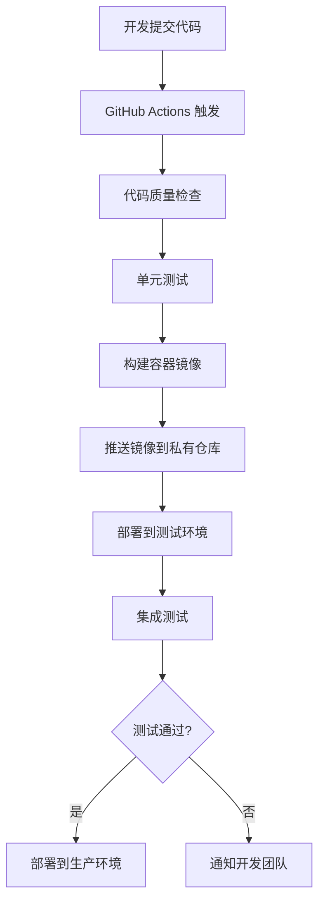

# DEPLOY-08-CI_CD 配置

## 1. CI/CD 概述

CI/CD（持续集成/持续部署）是自动化软件开发流程的关键环节，用于确保代码质量、加速部署并提高交付可靠性。本文档详细说明 eSIM 管理系统的 CI/CD 配置方案，包括 GitHub Actions 工作流定义、构建流程、测试策略和自动化部署流程。

## 2. CI/CD 架构

### 2.1 整体架构



### 2.2 主要组件

| 组件       | 功能描述           | 技术选型                    |
| ---------- | ------------------ | --------------------------- |
| 版本控制   | 代码管理与分支策略 | GitHub                      |
| CI 服务器  | 自动化构建与测试   | GitHub Actions              |
| 镜像仓库   | 存储容器镜像       | Docker Hub / 私有仓库       |
| 部署目标   | 测试与生产环境     | Kubernetes / Docker Compose |
| 监控与告警 | 构建与部署状态通知 | Slack / Email               |

## 3. GitHub Actions 配置

### 3.1 工作流文件结构

所有 GitHub Actions 工作流配置文件位于项目根目录的 `.github/workflows/` 目录下：

```plaintext
.github/workflows/
├── contract-tests.yml     # 契约测试工作流
├── e2e-playwright.yml     # 端到端测试工作流
├── icon-audit.yml         # 图标审计工作流
└── icon-smoke.yml         # 图标冒烟测试工作流
```

### 3.2 核心工作流配置示例

#### 3.2.1 契约测试工作流 (contract-tests.yml)

```yaml
name: Contract Tests

on:
  push:
    branches: [main, develop]
    paths:
      - "backend/**"
      - "docs/09-API文档/**"
  pull_request:
    branches: [main, develop]
    paths:
      - "backend/**"
      - "docs/09-API文档/**"

jobs:
  contract-tests:
    runs-on: ubuntu-latest
    steps:
      - uses: actions/checkout@v3

      - name: Set up Python
        uses: actions/setup-python@v4
        with:
          python-version: "3.10"

      - name: Install dependencies
        run: |
          python -m pip install --upgrade pip
          pip install -r backend/python/requirements.txt

      - name: Run contract tests
        run: |
          cd backend/python
          pytest -xvs tests/contract_tests/

      - name: Upload test results
        if: always()
        uses: actions/upload-artifact@v3
        with:
          name: contract-test-results
          path: backend/python/test-results/
```

#### 3.2.2 端到端测试工作流 (e2e-playwright.yml)

```yaml
name: End-to-End Tests

on:
  push:
    branches: [main, develop]
    paths:
      - "pure-admin-thin-max-ts/**"
      - "backend/**"
  pull_request:
    branches: [main, develop]
    paths:
      - "pure-admin-thin-max-ts/**"
      - "backend/**"
  workflow_dispatch: # 允许手动触发

jobs:
  e2e-tests:
    runs-on: ubuntu-latest
    steps:
      - uses: actions/checkout@v3

      - name: Set up Node.js
        uses: actions/setup-node@v3
        with:
          node-version: "16"

      - name: Install frontend dependencies
        run: |
          cd pure-admin-thin-max-ts
          npm install

      - name: Install Playwright
        run: npx playwright install --with-deps

      - name: Build and start services
        run: |
          docker-compose up -d
          sleep 30  # 等待服务启动

      - name: Run Playwright tests
        run: |
          cd pure-admin-thin-max-ts
          npx playwright test

      - name: Upload test results
        if: always()
        uses: actions/upload-artifact@v3
        with:
          name: playwright-report
          path: pure-admin-thin-max-ts/playwright-report/

      - name: Stop services
        if: always()
        run: docker-compose down
```

## 4. 自动化构建流程

### 4.1 前端构建流程

1. **代码检查**：

   - ESLint 静态代码分析
   - Prettier 代码格式化检查
   - 图标资源审计

2. **依赖安装与构建**：

   - 安装 npm 依赖
   - 执行 TypeScript 编译
   - 构建生产版本包

3. **构建产物验证**：
   - 检查构建产物完整性
   - 验证资源文件大小

### 4.2 后端构建流程

#### 4.2.1 Python 后端

1. **代码质量检查**：

   - Pylint 静态代码分析
   - Black 代码格式化检查
   - Bandit 安全漏洞扫描

2. **依赖安装**：

   - 安装 Python 依赖包
   - 验证依赖版本兼容性

3. **单元测试**：

   - 执行单元测试套件
   - 生成测试覆盖率报告

4. **容器镜像构建**：
   - 基于 Dockerfile 构建镜像
   - 优化镜像大小
   - 推送镜像到镜像仓库

#### 4.2.2 Go 后端

1. **代码检查**：

   - Go vet 静态代码分析
   - Go lint 代码风格检查

2. **编译与测试**：

   - 执行 Go 测试
   - 编译二进制文件

3. **容器镜像构建**：
   - 基于多阶段构建优化镜像
   - 推送镜像到镜像仓库

## 5. 自动化测试策略

### 5.1 测试层级

| 测试类型     | 执行时机        | 工具                   | 目标                        |
| ------------ | --------------- | ---------------------- | --------------------------- |
| 代码质量检查 | 每次提交/PR     | ESLint, Pylint, Go vet | 确保代码质量与风格一致性    |
| 单元测试     | 每次提交/PR     | Jest, pytest, Go test  | 验证单个函数/组件功能正确性 |
| 契约测试     | 后端 API 变更时 | 自定义测试框架         | 验证 API 符合契约规范       |
| 集成测试     | 构建完成后      | pytest, Newman         | 验证系统组件间交互          |
| 端到端测试   | 合并到主分支前  | Playwright             | 验证用户场景完整流程        |

### 5.2 测试结果报告

- 测试结果通过 GitHub Actions 输出到控制台
- 详细测试报告作为构建产物上传
- 失败测试通过邮件/Slack 通知相关团队

## 6. 自动化部署流程

### 6.1 部署策略

- **金丝雀部署**：新功能先部署到小部分服务器，验证后再全量发布
- **蓝绿部署**：准备两套环境，新版本在绿环境验证后切换流量
- **回滚机制**：保留历史版本镜像，出现问题时可快速回滚

### 6.2 环境部署流程

#### 6.2.1 测试环境部署

```yaml
# 测试环境部署步骤
steps:
  - name: Set up Docker Buildx
    uses: docker/setup-buildx-action@v2

  - name: Login to Docker Registry
    uses: docker/login-action@v2
    with:
      registry: ${{ secrets.DOCKER_REGISTRY }}
      username: ${{ secrets.DOCKER_USERNAME }}
      password: ${{ secrets.DOCKER_PASSWORD }}

  - name: Build and push frontend image
    uses: docker/build-push-action@v4
    with:
      context: ./pure-admin-thin-max-ts
      push: true
      tags: ${{ secrets.DOCKER_REGISTRY }}/esim-frontend:${{ github.sha }}

  - name: Build and push Python backend image
    uses: docker/build-push-action@v4
    with:
      context: ./backend/python
      push: true
      tags: ${{ secrets.DOCKER_REGISTRY }}/esim-python:${{ github.sha }}

  - name: Build and push Go backend image
    uses: docker/build-push-action@v4
    with:
      context: ./backend/go
      push: true
      tags: ${{ secrets.DOCKER_REGISTRY }}/esim-go:${{ github.sha }}

  - name: Deploy to test environment
    run: |
      ssh ${{ secrets.TEST_SERVER_USER }}@${{ secrets.TEST_SERVER_HOST }} "cd /path/to/project && \
      docker-compose -f docker-compose.yml pull && \
      docker-compose -f docker-compose.yml up -d"
```

#### 6.2.2 生产环境部署

生产环境部署需要额外的审批步骤，建议使用 GitHub Environments 功能进行配置：

```yaml
# 在工作流文件中添加生产环境部署作业
production-deploy:
  needs: [e2e-tests]
  runs-on: ubuntu-latest
  environment:
    name: production
    url: https://api.esim-management.example.com
  steps:
    - name: Deploy to production
      run: |
        # 生产环境部署脚本
        echo "Deploying to production environment..."
        # 实际部署命令
```

## 7. 环境变量与密钥管理

### 7.1 GitHub Secrets

所有敏感信息通过 GitHub Secrets 管理：

- `DOCKER_REGISTRY`：Docker 镜像仓库地址
- `DOCKER_USERNAME`：Docker 仓库用户名
- `DOCKER_PASSWORD`：Docker 仓库密码
- `TEST_SERVER_HOST`：测试服务器地址
- `TEST_SERVER_USER`：测试服务器用户名
- `PROD_SERVER_HOST`：生产服务器地址
- `PROD_SERVER_USER`：生产服务器用户名

### 7.2 环境特定配置

不同环境的配置文件管理：

- 开发环境：`.env.development`
- 测试环境：`.env.test`
- 生产环境：`.env.production`

## 8. CI/CD 最佳实践

### 8.1 工作流优化

1. **并行化测试**：将测试拆分到多个作业并行执行
2. **缓存依赖**：使用 GitHub Actions 缓存机制加速构建
3. **条件执行**：根据变更路径有条件地执行工作流
4. **定时任务**：定期执行完整测试以确保系统稳定性

### 8.2 常见问题处理

| 问题类型   | 可能原因                     | 解决方法                     |
| ---------- | ---------------------------- | ---------------------------- |
| 构建超时   | 依赖安装时间过长             | 优化依赖缓存，使用预构建镜像 |
| 测试不稳定 | 测试环境问题或测试代码不稳定 | 修复测试代码，改进环境隔离   |
| 部署失败   | 环境配置错误或权限问题       | 验证环境配置，检查部署脚本   |

## 9. 监控与告警集成

### 9.1 构建状态监控

- 配置 GitHub Actions 与监控系统集成
- 构建失败时自动创建问题单
- 生成每日构建状态报告

### 9.2 部署后验证

- 部署完成后自动执行健康检查
- 监控关键指标变化
- 异常时触发自动回滚

## 10. 总结与维护

定期审查和优化 CI/CD 流程是确保系统稳定交付的关键。随着项目发展，应持续评估现有工作流，引入新的工具和最佳实践，确保构建、测试和部署过程高效可靠。

---

## 11. 参考资料

- [GitHub Actions 文档](https://docs.github.com/cn/actions)
- [Docker 构建最佳实践](https://docs.docker.com/develop/develop-images/dockerfile_best-practices/)
- [CI/CD 管道设计模式](https://www.redhat.com/zh/topics/devops/what-is-ci-cd)

---

本文档由 eSIM 管理系统运维团队维护，最后更新时间：2023 年 12 月

---

## 12. 在 CI 中挂载错误处理与链路追踪 Hooks（Axios/Fetch）

为确保在测试与流水线阶段对错误处理与链路追踪进行一致性校验，建议统一挂载 `docs/07-部署与运维/ci/hooks.js` 中提供的拦截器/包装器。在 CI 中的最常见落地方式如下：

### 12.1 Jest 集成示例

1. 配置 `jest.config.js`：

```js
// jest.config.js
/**
 * 函数级注释：通过 setupFilesAfterEnv 在所有测试前加载 HTTP hooks，
 * 使出站请求自动注入 X-Request-ID，并在 4xx/5xx 响应时断言存在 X-Correlation-ID。
 */
module.exports = {
  testEnvironment: "node",
  setupFilesAfterEnv: ["<rootDir>/tests/setup/httpHooks.js"],
};
```

2. 在测试前置文件中统一装载（例如 `tests/setup/httpHooks.js`）：

```js
// tests/setup/httpHooks.js
/**
 * 函数级注释：统一在测试环境中创建带拦截器的 Axios 客户端，或包装原生 fetch。
 * - createAxiosClient(baseURL) 将自动注入 X-Request-ID 并在错误响应断言 X-Correlation-ID；
 * - wrapFetch(fetchImpl) 可在 Node.js 环境替代原生 fetch 以实现同样的校验逻辑。
 */
const {
  createAxiosClient,
  wrapFetch,
} = require("../../docs/07-部署与运维/ci/hooks");

// 可选：暴露全局 axios 客户端供测试使用
global.http = {
  client: createAxiosClient("http://localhost:8080"),
  fetch: wrapFetch(global.fetch || require("node-fetch")),
};
```

3. 在测试用例中直接使用：

```js
// tests/contract/error-handling.spec.js
/**
 * 函数级注释：以下用例演示对错误端点的契约断言；
 * - 当服务返回 4xx/5xx 时，hooks 会自动检查响应头是否包含 X-Correlation-ID；
 * - 若缺失，将抛出错误并使用例失败。
 */
describe("错误响应契约校验", () => {
  test("401 未授权应返回关联头与最小错误字段集", async () => {
    const res = await global.http.client
      .get("/api/v1/unauthorized")
      .catch((err) => err.response);
    expect(res.status).toBe(401);
    // 断言最小错误字段集
    const body = res.data;
    expect(body).toHaveProperty("error");
    expect(body).toHaveProperty("code");
    expect(body).toHaveProperty("timestamp");
    expect(body).toHaveProperty("path");
  });
});
```

### 12.2 Mocha 集成示例

1. 在命令行中通过 `--require` 预加载 hooks：

```bash
npx mocha --require tests/setup/httpHooks.mocha.js "tests/contract/**/*.spec.js"
```

2. 在预加载文件中装载 Axios/Fetch hooks：

```js
// tests/setup/httpHooks.mocha.js
/**
 * 函数级注释：Mocha 环境下的前置加载脚本；
 * - 注入全局 http.client 与 http.fetch，供各测试使用；
 */
const {
  createAxiosClient,
  wrapFetch,
} = require("../../docs/07-部署与运维/ci/hooks");

global.http = {
  client: createAxiosClient("http://localhost:8080"),
  fetch: wrapFetch(global.fetch || require("node-fetch")),
};
```

### 12.3 GitHub Actions 中的示例作业片段

```yaml
jobs:
  error-contract-tests:
    runs-on: ubuntu-latest
    steps:
      - uses: actions/checkout@v3
      - name: Set up Node.js
        uses: actions/setup-node@v3
        with:
          node-version: "18"
      - name: Install deps
        run: |
          npm ci
      - name: Start mock server
        run: |
          node docs/07-部署与运维/ci/mock_server.js &
          sleep 2
      - name: Run Jest contract tests
        run: |
          npx jest --config jest.config.js --runInBand
```

### 12.4 常见问题

- 若测试框架默认未加载 `global.fetch`，请在 `wrapFetch` 时使用 `node-fetch` 替代（如示例所示）。
- 若仅需对 Axios 进行校验，可直接使用 `createAxiosClient()` 并复用拦截器；无需包装 fetch。
- 若服务端将 `X-Correlation-ID` 与 `X-Request-ID` 对齐（如 `mock_server.js`），则可在断言阶段检查两者一致性；否则仅断言 `X-Correlation-ID` 存在。

更多细节参考：

- `docs/07-部署与运维/ci/hooks.js`
- `docs/07-部署与运维/ci/README.md`
- `docs/07-部署与运维/ci/mock_server.js`

### 12.5 使用 Postman newman 在 CI 中执行集合测试

为便于在流水线中自动验证错误处理与链路追踪的约定，可直接运行 Postman 集合 `docs/09-API文档/client-kits/postman_collection.json`。

1. macOS 安装 newman：

```bash
# 推荐使用 Homebrew 或 npm 安装
brew install newman
# 或
npm install -g newman

# 验证安装
newman -v
```

2. 本地执行集合并输出 JUnit 报表：

```bash
# 先启动本地模拟服务（另一个终端）
node docs/07-部署与运维/ci/mock_server.js &
sleep 2

# 运行集合（通过 env-var 覆盖 baseUrl）
newman run docs/09-API文档/client-kits/postman_collection.json \
  --env-var baseUrl=http://localhost:8080 \
  --reporters cli,junit \
  --reporter-junit-export reports/newman-results.xml
```

3. 以 Node.js 方式编程调用（示例脚本，含函数级注释）：

```js
// scripts/run_newman.js
/**
 * 函数级注释：以编程方式执行 Postman 集合，统一设置环境变量并导出 JUnit 报表。
 * 参数：
 * - collection: 集合文件路径
 * - envVars: 以键值对形式提供的环境变量（如 baseUrl）
 * - reporters: 报表类型数组（如 ['cli','junit']）
 * - junitOutput: JUnit 报表输出路径
 * 返回：Promise，resolve 表示执行完成且通过，reject 表示执行失败或断言失败
 */
const newman = require("newman");

function runNewman({
  collection,
  envVars = {},
  reporters = ["cli"],
  junitOutput = null,
}) {
  return new Promise((resolve, reject) => {
    const options = {
      collection,
      reporters,
      envVar: Object.entries(envVars).map(([key, value]) => ({ key, value })),
    };
    if (reporters.includes("junit") && junitOutput) {
      options.reporter = { junit: { export: junitOutput } };
    }

    newman.run(options, (err, summary) => {
      if (err) return reject(err);
      // 若存在断言失败，将以非 0 退出以便在 CI 中失败
      const failures = (summary.run?.failures || []).length;
      if (failures > 0) {
        return reject(new Error(`newman 断言失败数量：${failures}`));
      }
      resolve(summary);
    });
  });
}

// 示例执行（可在 CI 中调用）
if (require.main === module) {
  runNewman({
    collection: "docs/09-API文档/client-kits/postman_collection.json",
    envVars: { baseUrl: "http://localhost:8080" },
    reporters: ["cli", "junit"],
    junitOutput: "reports/newman-results.xml",
  })
    .then(() => {
      console.log("✅ newman 执行通过");
      process.exit(0);
    })
    .catch((e) => {
      console.error("❌ newman 执行失败：", e.message);
      process.exit(1);
    });
}
```

4. GitHub Actions 中的示例步骤（结合模拟服务与 newman 执行）：

```yaml
jobs:
  postman-contract-tests:
    runs-on: ubuntu-latest
    steps:
      - uses: actions/checkout@v3
      - name: Set up Node.js
        uses: actions/setup-node@v3
        with:
          node-version: "18"
      - name: Install newman
        run: |
          npm install -g newman
      - name: Start mock server
        run: |
          node docs/07-部署与运维/ci/mock_server.js &
          sleep 2
      - name: Run Postman collection via newman
        run: |
          newman run docs/09-API文档/client-kits/postman_collection.json \
            --env-var baseUrl=http://localhost:8080 \
            --reporters cli,junit \
            --reporter-junit-export reports/newman-results.xml
```

### 12.6 使用 Insomnia CLI（inso）在 CI 中执行集合/规范校验

Insomnia CLI（inso）可在终端或流水线中运行集合请求、执行设计文档测试或校验规范。

1. macOS 安装 inso：

```bash
brew install inso
inso --version
```

2. 列出集合与工作区资源名称（便于确认执行目标）：

```bash
# 使用 --src 指向已导出的工作区文件
inso list collections --src docs/09-API文档/client-kits/insomnia_workspace.json
```

3. 运行请求集合（以本地导出的 workspace JSON 为数据源）：

```bash
# 先启动本地模拟服务（另一个终端）
node docs/07-部署与运维/ci/mock_server.js &
sleep 2

# 执行集合（将 "集合名称" 替换为上一步 list 输出的实际名称）
inso run collection "客户端错误处理与链路追踪套件" \
  --src docs/09-API文档/client-kits/insomnia_workspace.json \
  --verbose
```

4. 可选：针对 OpenAPI 规范进行校验（inso + 设计文档或直接指向规范文件）：

```bash
# 若已在 Insomnia 中维护为 Design Document，可按名称运行
inso lint spec "eSIM管理系统 API 规范"

# 或直接指向规范文件（部分环境需搭配 --src）
inso lint spec --src docs/09-API文档/API-06-openapi.yaml
```

5. GitHub Actions 中使用 Docker 运行 inso（适配 Linux Runner）：

```yaml
jobs:
  insomnia-collection-tests:
    runs-on: ubuntu-latest
    steps:
      - uses: actions/checkout@v3
      - name: Start mock server
        run: |
          node docs/07-部署与运维/ci/mock_server.js &
          sleep 2
      - name: Run Insomnia collection via Docker
        run: |
          docker pull kong/inso:latest
          docker run --rm -v "$PWD":/work kong/inso:latest \
            run collection "客户端错误处理与链路追踪套件" \
            --src /work/docs/09-API文档/client-kits/insomnia_workspace.json \
            --verbose
```

提示：

- inso 将在当前工作目录的 `.insomnia/` 或传入的 `--src` 中查找数据；如通过 Insomnia 启用 Git Sync，可直接在 CI 检出后运行。
- `inso run test` 适用于 Insomnia 设计文档的“单元测试”功能；若需要集成此能力，请在 Insomnia 中补充测试并在 CLI 中按设计文档名称执行。

---

#### 补充：生成 HTML 报表（Postman newman - htmlextra）

在 CI 汇总测试结果时，建议同时生成可视化 HTML 报表以便快速定位失败请求与断言。newman 的 HTML 报表常用插件为 `newman-reporter-htmlextra`。

- 安装（macOS）：

  - 全局安装：`npm install -g newman-reporter-htmlextra`
  - 如果 newman 是本地依赖：在项目中运行：`npm install --save-dev newman-reporter-htmlextra`

- 命令行示例：

  - `newman run docs/09-API文档/client-kits/postman_collection.json --reporters cli,junit,htmlextra --reporter-junit-export reports/newman-results.xml --reporter-htmlextra-export reports/newman-report.html`

- Node.js 脚本（使用 `scripts/run_newman.js`）：
  - 通过环境变量启用 HTML 报表：`POSTMAN_ENABLE_HTML_REPORT=1`
  - 自定义 HTML 文件名：`POSTMAN_HTML_REPORT_FILE=newman-report.html`
  - 示例：`POSTMAN_ENABLE_HTML_REPORT=1 node scripts/run_newman.js`

> 说明：启用 `htmlextra` 报表前需确保插件已安装，否则 newman 会因找不到 `newman-reporter-htmlextra` 模块而报错。

---

### 12.7 附录：常见报错定位与排查清单

以下清单汇总了在 CI/CD 集合执行与错误处理契约校验中常见的失败原因与定位建议：

1. 缺少或不匹配的链路追踪请求头

- 现象：断言 `X-Correlation-ID` 或 `X-Request-ID` 失败；日志平台未能串联链路。
- 排查：
  - 检查是否在 Axios/Fetch 拦截器中注入 `X-Request-ID`，以及服务端是否回显/透传为 `X-Correlation-ID`。
  - 注意大小写与中划线，部分代理/网关可能会改写或小写化头名。
  - 本地/CI 的两端时间窗口是否重叠，避免通过日志查找时错过有效区间。

2. Axios 与 Fetch 拦截器未统一生效

- 现象：用例在 Node 环境通过 Axios 发送，但在浏览器/insomnia 中使用 Fetch，不同协议路径未注入头或未统一错误处理。
- 排查：
  - 确认 `docs/07-部署与运维/ci/hooks.js` 是否在各测试入口统一挂载。
  - 确认 Node 端 Fetch 版本与 polyfill（如 node-fetch）的一致性。

3. 基础 URL 或环境变量不正确

- 现象：大量 404/ECONNREFUSED；集合在本地通过但 CI 失败。
- 排查：
  - 检查 `POSTMAN_BASE_URL`、`INSO_BASE_URL` 等环境变量是否在 CI 正确注入。
  - mock server 是否按预期启动，端口是否冲突；Docker 运行时的工作目录映射是否正确。

4. CORS 或网关层拦截

- 现象：浏览器端失败但 Node/newman 正常；或反向代理返回 403/401。
- 排查：
  - 排除仅浏览器受限的跨域场景；在网关后面加白名单或关闭严格跨域校验用于 CI 测试。
  - 检查鉴权 Header 与签名是否被代理剥离或改写。

5. 断言与示例的版本漂移

- 现象：合同测试断言与 OpenAPI 规范/示例响应不一致。
- 排查：
  - 优先跑 Spectral Lint（已在 `.github/workflows/openapi-lint.yml` 集成）。
  - 将集合断言与 `docs/09-API文档/API-06-openapi.yaml` 更新同步；避免字段重命名未更新集合。

6. 插件与依赖缺失

- 现象：启用 HTML 报表时报错 `Cannot find module 'newman-reporter-htmlextra'`。
- 排查：
  - 在对应环境（本地或 CI）安装插件：`npm install -g newman-reporter-htmlextra` 或作为 dev 依赖。
  - Node 脚本中仅当环境变量启用时添加 `htmlextra` 报表，避免在未安装时强制使用导致失败。

7. 头名大小写与网关规范

- 现象：`X-Correlation-ID` 在断言中找不到，但抓包看到 `x-correlation-id`。
- 排查：
  - 在断言逻辑中对大小写不敏感或统一小写比较。
  - 在后端或 API 网关中统一规范回应头名。

8. 多实例与幂等性

- 现象：重复请求导致非幂等操作失败或数据污染，`X-Request-ID` 发生碰撞。
- 排查：
  - 确保 UUIDv4 生成正确且不复用；对非幂等接口增加测试前清理与后置回滚。

9. 结果收集与可视化不足

- 现象：CI 日志可读性差，难以定位失败步骤。
- 排查：
  - 启用 JUnit 与 HTML 报表，上传为 GitHub Actions Artifact；在 PR 中关联测试报告链接。

10. Insomnia 工作区路径或环境命名错误

- 现象：`inso run test` 提示找不到工作区或环境。
- 排查：
  - 检查 YAML/JSON 工作区文件路径与环境名（例如 `--env ci`）一致。
  - 若使用 Docker 运行 inso，确保 `-v` 挂载目录与工作目录 `-w` 设置正确。

如需将本清单扩展为团队标准，请在 `docs/07-部署与运维/DEPLOY-12-常见问题.md` 中补充适配您组织的网关、鉴权与日志平台细则。

---

### 12.8 报告查看与汇总指引（GitHub Actions）

为便于在 CI 中快速定位失败原因与总体质量，可通过以下方式查看与汇总集合测试结果：

1. 下载与查看构件（Artifacts）

- 在 GitHub 仓库页面进入 Actions -> 选择对应运行 -> 页面右侧 Artifacts 区域：
  - newman-junit-report：JUnit XML（可导入到测试报告工具或作为门禁依据）。
  - newman-html-report：HTML 可视化报告（快速查看失败请求、断言详情）。
  - inso-run-log（若启用）：Insomnia 集合运行日志（包含 CLI 详细输出）。

2. Step Summary（步骤摘要）

- 工作流会在运行结束时写入 Step Summary，包含报告位置说明与跳转提示；适合在 PR 中快速浏览。
- 如需在 Summary 中显示失败统计，可将 `scripts/run_newman.js` 的摘要信息（失败计数）写入一个 JSON 并在工作流中解析后输出。

3. 与测试与质量文档的联动

- 在 `docs/06-测试与质量/TEST-10-测试自动化指南.md` 中补充了“报告查看与常见解读指引”，并与本章节互相引用，确保跨团队一致的查看与解读流程。

建议：将报告链接或下载说明加入 PR 模板（`.github/PULL_REQUEST_TEMPLATE.md`），在代码评审时强制关联对应测试报告，提升缺陷发现效率。

## 12.9 摘要 JSON 字段说明与扩展实践（newman-summary.json）

为便于在 CI Step Summary 中展示更丰富的指标，脚本 `scripts/run_newman.js` 会在集合执行后生成 `reports/newman-summary.json`。核心字段如下（可能因 newman 版本或响应可用性而为空）：

- collection：集合名称
- timestamp：生成时间（ISO8601）
- stats：
  - failureCount：断言失败数量
  - requestsTotal：请求总数（来自 newman 的 run.stats）
  - assertionsTotal：断言总数
  - assertionsFailed：断言失败数量（与 failureCount 基本一致）
- failures：前端 Step Summary 用于列出失败详情（错误名称、消息、来源 item）
- failureClusters：失败断言聚类（按文件夹路径 + 断言名），用于快速识别高频失败；字段 { folder, assertion, count, examples[] }
  - share：每个聚类的占比（相对 totalFailures 的百分比，保留 1 位小数）
  - failureClustersMeta：聚类元信息，含 { totalFailures, clusterCount, clusteredFailuresCount, coveragePercent }
- distributions：
  - statusCodes：按响应状态码统计的分布，如 { "200": 20, "400": 3 }
- topSlowRequests：最慢请求 Top 5（若可获取响应时间），含 name、code、responseTime
- responseTimePercentiles：全局响应时间分位数统计，含 p50/p90/p95/p99（单位 ms）
- folderAggregates：按“文件夹路径”聚合的统计信息，字段：
  - requests：该文件夹下请求数
  - assertionsTotal / assertionsFailed：断言总数/失败数
  - statusCodes：该文件夹的状态码分布
  - responseTime：耗时统计（min/max/avg 及 p50/p90/p95/p99，单位 ms）
- methodAggregates：按 HTTP 方法聚合的统计信息（GET/POST/PUT/DELETE 等），字段同上（requests/assertions/statusCodes/responseTime）
- pathAggregates：按路径前缀聚合的统计信息（例如 /api/v1、/users 等），字段同上（requests/assertions/statusCodes/responseTime）
- budgets：性能预算配置回显，含 configPath 与 config（支持 failOnBudgetBreach、global/folders/methods/paths 下的 responseTime 阈值 p50/p90/p95/p99）
- budgetBreaches：性能预算超标列表，元素结构 { scope, key, point, actual, threshold }
- reporting：摘要/报告配置回显，含 configPath 与 config（来源 scripts/newman-config.json）。目前支持：
  - failureClusters.topN：Step Summary 展示的失败聚类条数上限（默认 10）
  - failureClusters.headK：用于计算并展示“头部 K 类累计占比”的 K 值（默认 3）
  - failureClusters.headKThresholdPercent：集中度门禁阈值（百分比，默认 70），当“头部 K 类累计占比”≥ 该值时触发告警/失败
  - failureClusters.failOnHeadKThresholdBreach：是否开启集中度门禁（默认 false）；开启后在无断言失败的前提下达到阈值将以退出码 3 结束
  - failureClusters.examplesPerCluster：每个聚类示例消息条数上限（默认 3）
  - failureClusters.normalizeMessages：是否启用失败消息归一化（默认 true）
  - failureClusters.normalization：归一化细则（布尔开关）。默认启用：stripUUID/stripHex/stripNumbersLong/stripISODateTime。可选（默认关闭以避免过度匹配）：
    - stripUUID：将 UUID 替换为 <UUID>（默认开启）
    - stripHex：将 32~40 位 HEX 串替换为 <HEX>（默认开启）
    - stripNumbersLong：将 6 位及以上纯数字替换为 <NUM>（默认开启）
    - stripISODateTime：将 ISO8601 时间戳替换为 <TIMESTAMP>（默认开启）
    - stripEmail：将邮箱替换为 <EMAIL>（默认关闭）
    - stripIPv4：将 IPv4 替换为 <IPV4>（默认关闭）
    - stripIPv6：将 IPv6 替换为 <IPV6>（默认关闭）
    - stripPhone：将常见电话号替换为 <PHONE>（默认关闭）
    - stripURLQueryValues：将 URL 查询参数的值替换为 <VAL>（默认关闭）
- reports：报告路径（junit、html）用于在 Actions 中快速定位 Artifact

扩展建议：

- 如果需要更细粒度数据（如按文件夹/接口分组统计、响应体大小、断言耗时）可以在 `writeNewmanSummary()` 中从 `summary.run.executions` 提取并追加字段，同时在工作流中解析展示。
  - 已内置：按文件夹聚合统计（requests/assertions/statusCodes/responseTime）以及全局耗时分位数（p50/p90/p95/p99）。
  - 已增补：每个文件夹的耗时分位数；按方法与路径前缀的聚合统计。
  - 可进一步扩展：为每个方法/路径前缀计算更细分的分位数，导出失败断言 TopK 的来源路径与 id，或记录响应体大小分布与网关路由标签等。
- 与测试自动化文档联动：参见《测试与质量/TEST-10-测试自动化指南》11.2 小节关于摘要 JSON 的解读与扩展建议。

补充说明：

- 性能预算检查：工作流 Step Summary 已新增“性能预算检查”段落，若开启 failOnBudgetBreach 且存在超标，将以退出码 2 结束（断言失败仍为退出码 1），便于区分功能性失败与性能预算失败。
- 聚类集中度门禁：若开启 `failureClusters.failOnHeadKThresholdBreach` 且“头部 K 类累计占比”达到 `failureClusters.headKThresholdPercent`，在无断言失败时将以退出码 3 结束；用于监控失败是否过度集中于少数类别（便于快速聚焦根因）。
- 失败聚类展示：Step Summary 的“失败断言聚类”段落会读取 `reporting.failureClusters.topN` 控制展示条数；示例消息条数由 `examplesPerCluster` 控制。配置文件位于 `scripts/newman-config.json`。
  - 同时读取 `reporting.failureClusters.headK` 计算并展示“头部 K 类累计占比”（默认按 K=3 统计），配合覆盖率（coveragePercent）与每类占比（share）一起用于快速评估高频失败集中度。
  - 同时展示聚类覆盖率（coveragePercent）与每类占比（share），便于评审时快速聚焦主要问题来源。

环境变量覆盖与 workflow_dispatch 输入（HeadK 门禁）：

- 目的：在不同分支/场景下无需改动仓库配置文件即可临时调整“失败聚类集中度门禁”的参数。
- 环境变量覆盖（优先级高于 `scripts/newman-config.json`）：`scripts/run_newman.js` 在 `loadReportingConfig()` 入口调用 `applyFailureClusterEnvOverrides()`，支持以下环境变量（未设置的变量不覆盖原配置）：
  - `POSTMAN_HEADK_K`：头部 K 值（整数），对应 `reporting.failureClusters.headK`。
  - `POSTMAN_HEADK_THRESHOLD`：门禁阈值（百分比，整数或小数），对应 `reporting.failureClusters.headKThresholdPercent`。
  - `POSTMAN_HEADK_GATE_ON`：门禁开关（布尔，`true`/`false`），对应 `reporting.failureClusters.failOnHeadKThresholdBreach`。
- workflow_dispatch 输入：`api-collection-tests.yml` 已新增三个输入并在运行步骤中注入为上述环境变量，实现 Actions 运行时动态控制。
  - `headk_k` -> `POSTMAN_HEADK_K`
  - `headk_threshold` -> `POSTMAN_HEADK_THRESHOLD`
  - `headk_gate_on` -> `POSTMAN_HEADK_GATE_ON`
- YAML 片段示例（节选）：

```
on:
  workflow_dispatch:
    inputs:
      headk_threshold:
        description: "HeadK 门禁阈值（百分比）"
        required: false
        default: "70"
      headk_k:
        description: "用于累计占比的 K 值"
        required: false
        default: "3"
      headk_gate_on:
        description: "是否开启 HeadK 门禁（true/false）"
        required: false
        default: "true"

jobs:
  postman_collection_tests:
    steps:
      - name: Run Postman collection via script
        env:
          POSTMAN_HEADK_THRESHOLD: ${{ github.event.inputs.headk_threshold }}
          POSTMAN_HEADK_K: ${{ github.event.inputs.headk_k }}
          POSTMAN_HEADK_GATE_ON: ${{ github.event.inputs.headk_gate_on }}
        run: |
          node scripts/run_newman.js
```

- 使用方式：
  - GitHub Actions 页面 -> 选择该工作流 -> Run workflow -> 设置 `headk_threshold=80`、`headk_k=3`、`headk_gate_on=true` 即可按需调整门禁。
  - 也可通过 GitHub CLI 触发（示例）：

```
gh workflow run api-collection-tests.yml \
  -f headk_threshold=80 \
  -f headk_k=3 \
  -f headk_gate_on=true
```

- 行为与退出码约定（与前文一致）：
  - 存在断言失败：退出码 1；
  - 仅性能预算超标（开启 failOnBudgetBreach）：退出码 2；
  - 无断言失败且“头部 K 类累计占比”达到阈值（开启 failOnHeadKThresholdBreach）：退出码 3。
- 本地快速验证（Mac）：

```
export POSTMAN_HEADK_K=3
export POSTMAN_HEADK_THRESHOLD=80
export POSTMAN_HEADK_GATE_ON=true
node scripts/run_newman.js

# 如果仅需查看 demo 摘要中的门禁回显，可运行：
node scripts/generate_demo_summary.js
node scripts/check_demo_headk_gate.js
```
